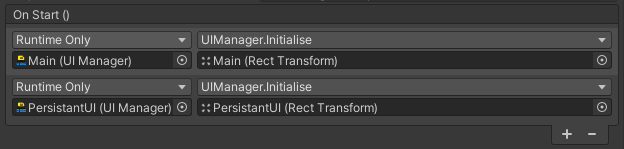
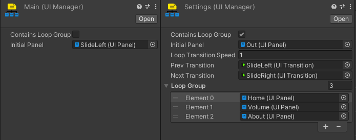
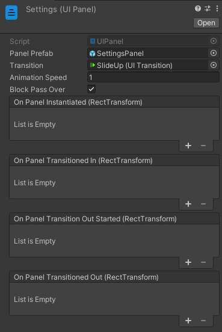
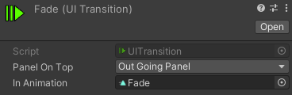

#  unity-ui-manager

A Simple UI Manager for rapid prototyping and ease of collaboration

# Features
-----------
- Extremely modular - forget about merge conflicts!
- Very fast to get a prototype up and running
- Pretty UI Transitions just as easy as GameObject.SetActive()
- Very simple inspector with minimal inputs, a great way to bridge the experience gap between a developer and a designer
- Use of Animations give an incredible amount of control over transitions
- No code required

# Contents
-----------
- [UI Manager](https://github.com/Rellac-Rellac/unity-ui-manager#ui-manager)
- [UI Panel](https://github.com/Rellac-Rellac/unity-ui-manager#ui-panel)
- [UI Transition](https://github.com/Rellac-Rellac/unity-ui-manager#ui-transition)
- [Adding an Animation](https://github.com/Rellac-Rellac/unity-ui-manager#adding-an-animation)
- [Attribution](https://github.com/Rellac-Rellac/unity-ui-manager#attribution)

# UI Manager
------------
**Create > UI > Manager**

The UI Manager is used to instantiate a starting point and flip between panels in that RectTransform. Multiple managers can be used throughout the project and they can reference any UI Panel object.

A Manager must first be Initialised with a starting RectTransform before panels can be called.

An initialised Manager can swap between panels via SetPanel(UIPanel)

UI Managers can be set to have "loop groups" - if so, you will specify here a previous/next transition to override what is specified in the UIPanels listed on the UIManager. Panels will logically transition by calling NextPanel() and PreviousPanel() in the UIManager, the index will reset automatically. A Manager with a loop group will override the speed of the animation transition. That value is set here.

# UI Panel
----------
**Create > UI > Panel**

UI Panels are used to reference the panel prefab and the transition animation used for each panel.

Assign a prefab here to instantiate whenever this UIPanel is called - root will be adjusted to a stretched fit over the target RectTransform of the UI Manager

Specify here the transition animation that you would like to use. The speed of the transition is specified in seconds 

You can enable the passover click blocker for your smaller panels to prevent clicking unwanted background buttons

Events are available for whenever this panel is instantiated and when the transitions in/out have ended

# UI Transition
----------------
**Create > UI > Transition**

UI Transitions are references by the UIPanel to know which animation to play and which way to order the panels. The animation must be listed in the Animator Controller of the UIRoot prefab

Here you can set the "Panel on Top" to be either the panel currently coming in, or the panel currently going away.

See "Adding an Animation" for further info on the specifics of the required animation

# UI Panel Listener
--------------------
UIPanelListener can be added to any GameObject and will listen for the relevant events of any specified panel. This can be used to trigger an animation within the panel once it has transitioned or to hide a GameObject until the transition has finished.

Available events to register to:

# Adding an Animation
----------------------
Animations can be added to the prefab located at UIManager/Resources/UIManager/UI Root

Do not adjust the sizeDelta in your animation - this value is adjusted by the UIFitter on the UI Root prefab. It will automatically adjust the Rect to fit the specified parent Rect

The "Parent_In" object is the panel that is currently coming in and will end as the main panel the user is looking at

The "Parent_Out" object is the panel that is currently already in and will end out of sight of the user

If a new GameObject is required to create your bespoke transition, make sure that the starting pose is in its "off"
state so that other animations don't need to reference it - see the behaviour of the currently disabled GameObjects
under the UI Root prefab animations

Animations should last 1 second each so that we can specify the speed in seconds - don't worry if the transition is
too fast at 1 second - simply specify a larger time in your UIPanel Object

If you want the out parent to clear its contents early (default is at the end of the transition), simply add an Animation Event to your Animation and call ClearOutParent()

# Attribution
--------------
I've used some icons under the creative commons license for this manager

You shouldn't need to add these attributions your application, as they only show in the editor:

UIManager
- Electronic Data Storage by ProSymbols from the Noun Project

UIPanel
- page by Kirsh from the Noun Project

UITransition
- play by Royyan Razka from the Noun Project
